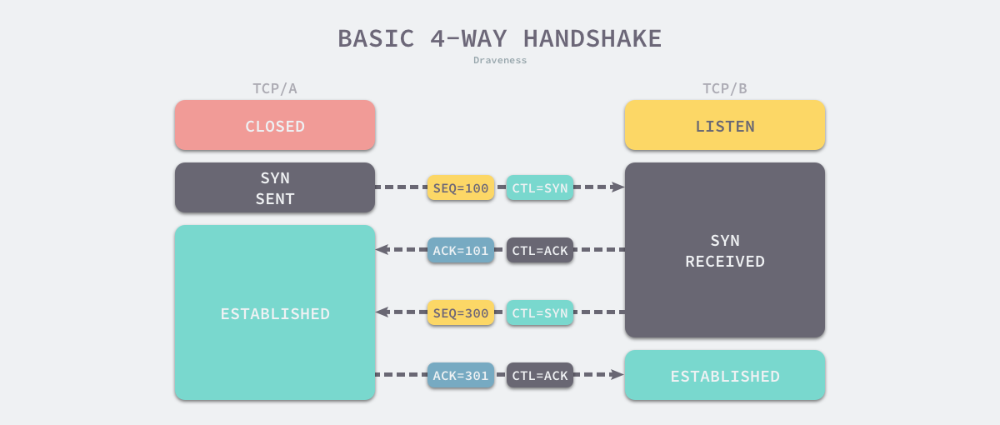

## TCP 为什么需要三次握手
本文灵感来自于 [ Draveness 博客](https://draveness.me/whys-the-design-tcp-three-way-handshake/)

首先，三次握手是为了建立稳定的TCP连接，了解什么是连接十分必要；第二，我们需要将视角从为什么需要**三次**握手，切换至为什么需要**三次握手**；最后，从连接过程的视角剖析三次握手。

### 什么是连接
根据 [RFC 793 - Transmission Control Protocol](https://datatracker.ietf.org/doc/html/rfc793) 文档
> The reliability and flow control mechanisms described above require that TCPs initialize and maintain certain status information for each data stream. The combination of this information, including sockets, sequence numbers, and window sizes, is called a connection.

总结一下：用于保证可靠性和流控制机制的信息，包括 Socket、序列号以及窗口大小叫做连接。

其中包含三个要素，所以，建立TCP连接通信的过程，就是让双方对上述三个要素达成共识。其中，连接中的一对 **Socket** 是由互联网地址标志符和端口组成的，**窗口大小**主要用来做流控制，最后的**序列号**是用来追踪通信发起方发送的数据包序号，接收方可以通过序列号向发送方确认某个数据包的成功接收。

因此，问题转变为：为什么需要通过三次握手才可以初始化 Sockets、窗口大小和初始序列号？

### 视角转换
[RFC 793 - Transmission Control Protocol](https://datatracker.ietf.org/doc/html/rfc793)  其实就指出了 TCP 连接使用三次握手的首要原因 —— 为了阻止历史的重复连接初始化造成的混乱问题，防止使用 TCP 协议通信的双方建立了错误的连接。
> The principle reason for the three-way handshake is to prevent old duplicate connection initiations from causing confusion.

想象如果只有两次握手，一旦一方发起建立连接的请求，就无法撤回，如果网络情况较差，发送方连续多次发送请求，接收方只有两个选择，接受或者拒绝，它并不知道这一次的请求是不是过期请求。

所以，TCP 选择使用三次握手来建立连接并在连接引入了 RST 这一控制消息，接收方当收到请求时会将发送方发来的 SEQ+1 发送给对方，这时由发送方来判断当前连接是否是历史连接：
* 如果当前连接是历史连接，即 SEQ 过期或者超时，那么发送方就会直接发送 RST 控制消息中止这一次连接；
* 如果当前连接不是历史连接，那么发送方就会发送 ACK 控制消息，通信双方就会成功建立连接；

使用三次握手和 RST 控制消息将是否建立连接的最终控制权交给了发送方，因为只有发送方有足够的上下文来判断当前连接是否是错误的或者过期的，这也是 TCP 使用三次握手建立连接的最主要原因。

### 三次握手
解决了重复连接初始化的问题，我们还遇到网络不确定性造成的数据包缺失和顺序颠倒等问题：
* 数据包被发送方多次发送造成数据的重复；
* 数据包在传输的过程中被路由或者其他节点丢失；
* 数据包到达接收方可能无法按照发送顺序；

为了解决这个问题，TCP协议要求发送方在数据包中加入序列号，有了数据包对应的序列号，我们就可以：
* 接收方可以通过序列号对重复的数据包进行去重；
* 发送方会在对应数据包未被 ACK 时进行重复发送；
* 接收方可以根据数据包的序列号对它们进行重新排序；

序列号在 TCP 连接中有着非常重要的作用，初始序列号作为 TCP 连接的一部分也需要在三次握手期间进行初始化，由于 TCP 连接通信的双方都需要获得初始序列号，所以它们其实需要向对方发送 SYN 控制消息并携带自己期望的初始化序列号 SEQ，对方在收到 SYN 消息之后会通过 ACK 控制消息以及 SEQ+1 来进行确认。

如上图所示，通信双方的两个 TCP A/B 分别向对方发送 SYN 和 ACK 控制消息，等待通信双方都获取到了自己期望的初始化序列号之后就可以开始通信了，将上图第二三次合并，就可以将四次缩短成三次。

### 总结
TCP 建立连接时通过三次握手可以有效地避免历史错误连接的建立，减少通信双方不必要的资源消耗，三次握手能够帮助通信双方获取初始化序列号，它们能够保证数据包传输的不重不丢，还能保证它们的传输顺序，不会因为网络传输的问题发生混乱，到这里不使用『两次握手』和『四次握手』的原因已经非常清楚了：

* 『两次握手』：无法避免历史错误连接的初始化，浪费接收方的资源；
* 『四次握手』：TCP 协议的设计可以让我们同时传递 ACK 和 SYN 两个控制信息，减少了通信次数，所以不需要使用更多的通信次数传输相同的信息；