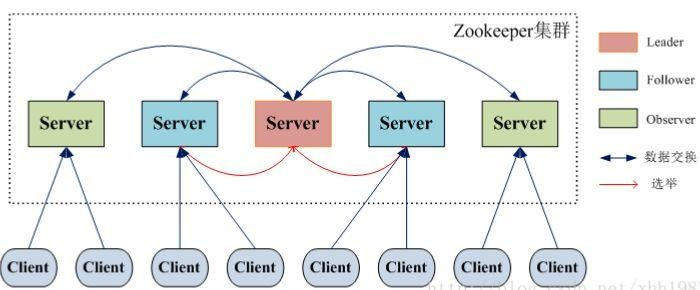
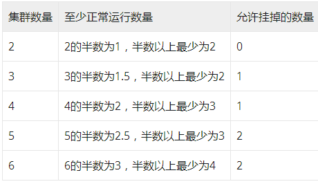

## ZooKeeper 总结
实习中需要参与开发服务中心，服务中心模块中依赖 zookeeper，进行服务注册、管理和监听
服务中心实现过程中通过zookeeper来存储，zookeeper 的结构如下：
``` 
/servicecenter
└── /service                  # 服务配置
    ├── tcloud-cbs-apiserver  # 以服务ID命名，包含所有的服务信息
    └── tcloud-cvm-api
```

### Zookeeper是什么
ZooKeeper 是一个分布式的，开放源码的分布式应用程序协同服务。ZooKeeper 的设计目标是将那些复杂且容易出错的分布式一致性服务封装起来，构成一个高效可靠的原语集，并以一系列简单易用的接口提供给用户使用。
> 原语： 操作系统或计算机网络用语范畴。它是由若干条指令组成的，用于完成一定功能的一个过程。具有不可分割性，即原语的执行必须是连续的，在执行过程中不允许被中断。

### ZooKeeper数据模型
在这里，可以看到 znode 是一个标准的文件系统，层次结构很像一棵树。 需要注意的一些要点如下：
* 根节点有一个名为/zoo的子节点，它又有三个 znode。
* ZooKeeper树中的每个znode都由一个路径标识，路径元素由『/』分隔。
* Zookeeper是树状结构，树是由节点所组成，Zookeeper 的数据存储也同样是基于节点，这种节点叫做Znode
* 这些节点被称为数据寄存器，因为它们可以存储数据。 因此，一个 znode 可以有子节点以及与之相关的数据。 这与文件系统可以把文件作为路径很类似。


### ZooKeeper集群
#### 集群概览
为了保证高可用，最好是以集群形态来部署 ZooKeeper，这样只要集群中大部分机器是可用的（能够容忍一定的机器故障），那么 ZooKeeper 本身仍然是可用的。

客户端在使用 ZooKeeper 时，需要知道集群机器列表，通过与集群中的某一台机器建立 TCP 连接来使用服务。

客户端使用这个 TCP 链接来发送请求、获取结果、获取监听事件以及发送心跳包。如果这个连接异常断开了，客户端可以连接到另外的机器上。


可以看到，在Arm环境的规划中，是有三套zk环境的，一套集群有三台机器，这符合文档里说的：
> 集群高可用设置至少需要三个服务器，建议使用奇数个服务器。如果只有两台服务器，那么您将处于一种情况，如果其中一台服务器发生故障，则没有足够的计算机构成多数仲裁（涉及到leader机制）。由于存在两个单点故障，因此两个服务器本来就不如单个服务器稳定。

#### 集群角色
最典型集群模式：Master/Slave 模式（主备模式），例如 MySQL。

在这种模式中，通常 Master 服务器作为主服务器提供写服务，其他的 Slave 服务器从服务器通过异步复制的方式获取 Master 服务器最新的数据提供读服务。

但是，在 ZooKeeper 中没有选择传统的 Master/Slave 概念，而是引入了Leader、Follower 和 Observer 三种角色。



ZooKeeper 集群中的所有机器通过一个 Leader 选举过程来选定一台称为 “Leader” 的机器。

Leader 既可以为客户端提供写服务又能提供读服务。除了 Leader 外，Follower 和 Observer 都只能提供读服务。Leader是整个 Zookeeper 集群工作机制中的核心，作为整个 ZooKeeper 集群的主节点，负责响应所有对 ZooKeeper 状态变更的请求。

#### Leader算法
1. 每个 server 发出一个投票，投票的最基本元素是（SID-服务器id,ZXID-事物id）
2. 接受来自各个服务器的投票
3. 处理投票，优先检查 ZXID(数据越新ZXID越大),ZXID比较大的作为leader，ZXID 一样的情况下比较 SID
4. 统计投票，这里有个过半的概念，大于集群机器数量的一半，即大于或等于（n/2+1）,我们这里的由三台，大于等于2即为达到“过半”的要求。

这里也有引申到为什么 Zookeeper 集群推荐是单数。



通过以上可以发现，3台服务器和4台服务器都最多允许1台服务器挂掉，5台服务器和6台服务器都最多允许2台服务器挂掉,明显4台服务器成本高于3台服务器成本，6台服务器成本高于5服务器成本。

这是由于半数以上投票通过决定的。

### ZooKeeper功能
ZooKeeper 是一个典型的分布式数据一致性解决方案，分布式应用程序可以基于 ZooKeeper 实现诸如数据发布/订阅、负载均衡、命名服务、分布式协调/通知、集群管理、Master 选举、分布式锁和分布式队列等功能。

ZooKeeper 一个最常用的使用场景就是用于担任服务生产者和服务消费者的注册中心。

服务生产者将自己提供的服务注册到 ZooKeeper 中心，服务的消费者在进行服务调用的时候先到 ZooKeeper 中查找服务，获取到服务生产者的详细信息之后，再去调用服务生产者的内容与数据。

这也是服务管理中服务中心的 ZooKeeper 的作用。

### ZooKeeper Watch