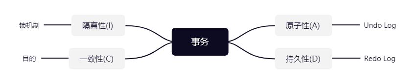

## 认识事务
事务是数据库区别于文件系统的重要特性之一，事务的四个特性是 ACID，四个单词的缩写：

* 原子性（Atomicity）
* 一致性（Consistency）
* 隔离性（Isolation）
* 持久性（Durability）

### 原子性
#### 定义
原子性是指一个事务是一个不可分割的工作单位，其中的操作要么都做，要么都不做；如果事务中一个sql语句执行失败，则已执行的语句也必须回滚，数据库退回到事务前的状态。

#### 实现原理：Undo Log
实现原子性的关键，是当事务回滚时能够撤销所有已经成功执行的sql语句。InnoDB实现回滚，靠的是undo log：当事务对数据库进行修改时，InnoDB会生成对应的undo log；如果事务执行失败或调用了rollback，导致事务需要回滚，便可以利用undo log中的信息将数据回滚到修改之前的样子。

undo log属于逻辑日志，它记录的是sql执行相关的信息。当发生回滚时，InnoDB会根据undo log的内容做与之前相反的工作：对于每个insert，回滚时会执行delete；对于每个delete，回滚时会执行insert；对于每个update，回滚时会执行一个相反的update，把数据改回去。

### 持久性
#### 定义
持久性是指事务一旦提交，它对数据库的改变就应该是永久性的。接下来的其他操作或故障不应该对其有任何影响。

#### 实现原理：Redo Log
当数据修改时，会在redo log记录这次操作；当事务提交时，会调用fsync接口对redo log进行刷盘。如果MySQL宕机，重启时可以读取redo log中的数据，对数据库进行恢复。redo log采用的是WAL（Write-ahead logging，预写式日志），所有修改先写入日志，再更新到Buffer Pool，保证了数据不会因MySQL宕机而丢失，从而满足了持久性要求。

### 隔离性
#### 定义
与原子性、持久性侧重于研究事务本身不同，隔离性研究的是不同事务之间的相互影响。隔离性是指，事务内部的操作与其他事务是隔离的，并发执行的各个事务之间不能互相干扰。严格的隔离性，对应了事务隔离级别中的Serializable (可串行化)，但实际应用中出于性能方面的考虑很少会使用可串行化。

隔离性追求的是并发情形下事务之间互不干扰。简单起见，我们主要考虑最简单的读操作和写操作(加锁读等特殊读操作会特殊说明)，那么隔离性的探讨，主要可以分为两个方面：

(一个事务)写操作对(另一个事务)写操作的影响：锁机制保证隔离性
(一个事务)写操作对(另一个事务)读操作的影响：MVCC保证隔离性

#### 锁机制
行锁与表锁
按照粒度，锁可以分为表锁、行锁以及其他位于二者之间的锁。表锁在操作数据时会锁定整张表，并发性能较差；行锁则只锁定需要操作的数据，并发性能好。

排它锁与共享锁

#### 脏读、不可重复读和幻读
* 脏读：一个事务还未提交，另外一个事务访问此事务修改的数据，并使用，读取了事务**未提交**的状态数据。
* 不可重复读：一个事务读取同一条记录2次，得到的结果不一致，由于在2次读取之间另外一个事务对此行数据进行了**修改**。
* 幻读：一个事务读取2次，得到的记录条数不一致，由于2次读取之间另外一个事务对数据进行了**增删**。

#### 事务隔离级别

在实际应用中，读未提交在并发时会导致很多问题，而性能相对于其他隔离级别提高却很有限，因此使用较少。可串行化强制事务串行，并发效率很低，只有当对数据一致性要求极高且可以接受没有并发时使用，因此使用也较少。

因此在大多数数据库系统中，默认的隔离级别是读已提交(如Oracle，RC)或可重复读（如InnoDB，后文简称RR）。

#### MVVC（解决幻读）
RR解决脏读、不可重复读，但解决幻读问题，使用的是MVCC：Multi-Version Concurrency Control，即多版本的并发控制协议。

### 一致性
#### 定义
一致性是指事务执行结束后，数据库的完整性约束没有被破坏，事务执行的前后都是合法的数据状态。数据库的完整性约束包括但不限于：实体完整性（如行的主键存在且唯一）、列完整性（如字段的类型、大小、长度要符合要求）、外键约束、用户自定义完整性（如转账前后，两个账户余额的和应该不变）。

#### 实现
一致性是事务追求的最终目标：前面提到的原子性、持久性和隔离性，都是为了保证数据库状态的一致性。此外，除了数据库层面的保障，一致性的实现也需要**应用层面**进行保障。

### 总结
原子性：语句要么全执行，要么全不执行，是事务最核心的特性，事务本身就是以原子性来定义的；实现主要基于undo log

持久性：保证事务提交后不会因为宕机等原因导致数据丢失；实现主要基于redo log

隔离性：保证事务执行尽可能不受其他事务影响；InnoDB默认的隔离级别是RR，RR的实现主要基于锁机制（包含next-key lock）、MVCC（包括数据的隐藏列、基于undo log的版本链、ReadView）

一致性：事务追求的最终目标，一致性的实现既需要数据库层面的保障，也需要应用层面的保障