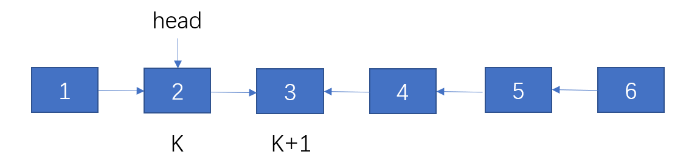

## 面向面试做题 - 链表篇

### 分类

### 链表反转类
一、单链表反转

直接上代码
```
class Solution {
public:
    ListNode* reverseList(ListNode* head) {
        if (head==nullptr || head->next==nullptr) return head;
        ListNode *last = reverseList(head->next);
        head->next->next = head;
        head->next = nullptr;
        return last;
    }
};
```

三指针法不展开，着重讲递归法。

这段代码看似难以理解，实际上核心点是递归的精髓，分析递归问题，不要去模拟递归栈的操作，人脑比不上电脑，要用函数思维，从结果推过程。

我们假设链表 1-n, 其中递归进行到 k，即 1->k 正序，k+1->n 逆序(不要纠结怎么逆的)；
在这个情况下，我们要如何继续操作呢，很明显，将k+1这个指针接到k上，同时k本身指向空。

于是有操作，head->next 指 k+1 这个节点，head->next->next 指向 head

